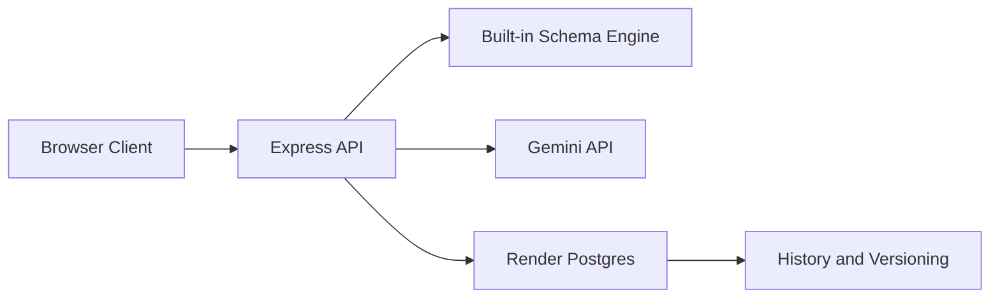

# SchemaAI DBMS Studio

SchemaAI DBMS Studio is a full-stack AI-assisted database schema design project for DBMS coursework. The project now has one primary shape:

- a Node.js + Express backend
- a persistent database layer
- a browser client for schema generation, validation, normalization, and history
- Render deployment support for a real public cloud deployment

The static GitHub Pages site is still available, but only as an optional frontend client. The main project is the cloud-backed application.

## Live Links

- GitHub Pages client: [https://eshita-chauhan.github.io/DBMS-project/](https://eshita-chauhan.github.io/DBMS-project/)
- Render backend app: [https://schemaai-studio-3krp.onrender.com](https://schemaai-studio-3krp.onrender.com)
- Render health check: [https://schemaai-studio-3krp.onrender.com/api/health](https://schemaai-studio-3krp.onrender.com/api/health)

[](https://render.com/deploy?repo=https://github.com/ESHITA-CHAUHAN/DBMS-project)

## About Architecture

- Frontend: a browser UI built with `index.html`, `style.css`, and `app.js`
- Backend: an Express server in `server.js` exposes generation, validation, and save APIs
- Database: Render Postgres is the primary live store, with SQLite only as a local development fallback
- AI provider layer: the app now keeps a built-in schema engine plus Gemini API generation
- History and versioning: every saved design can persist as projects, schema versions, validation runs, findings, and revision events
- Deployment: GitHub Pages can act as a client, while Render hosts the real backend and cloud database



## Main architecture

### Cloud-first app

- Browser UI: `index.html`, `style.css`, `app.js`
- Backend API: `server.js`
- Database adapter selection: `server/db.js`
- Production database: PostgreSQL
- Local fallback database: SQLite
- Deployment target: Render web service + Render Postgres

### Optional static client

GitHub Pages only publishes the static frontend files. It does not run the backend.

Public static client URL:

[https://eshita-chauhan.github.io/DBMS-project/](https://eshita-chauhan.github.io/DBMS-project/)

Once the Render backend is live, the static client can use it with:

```text
https://eshita-chauhan.github.io/DBMS-project/?apiBase=https://your-render-service.onrender.com
```

## What the project does

1. Accepts a plain-English system description
2. Generates normalized SQL schemas
3. Validates the SQL for keys, references, and structure
4. Lets the user refine SQL manually in a workbench
5. Saves projects, versions, findings, and revision history
6. Shows a meta-schema view for DBMS lifecycle tracking
7. Includes a normalization lab for functional dependency analysis

## Project structure

```text
.
|-- index.html
|-- style.css
|-- app.js
|-- server.js
|-- render.yaml
|-- package.json
|-- .env.example
|-- server/
|   |-- db.js
|   |-- schema-engine.js
|   `-- db/
|       |-- helpers.js
|       |-- postgres-store.js
|       `-- sqlite-store.js
|-- sql/
|   `-- core_meta_schema.sql
`-- .github/
    `-- workflows/
        `-- pages.yml
```

## Backend API

The backend exposes:

- `GET /api/health`
- `POST /api/generate`
- `POST /api/validate`
- `POST /api/projects`
- `GET /api/projects`
- `GET /api/projects/:id`
- `DELETE /api/projects`
- `GET /api/meta/schema`
- `GET /api/meta/rows`

## Database behavior

### Production

When `DATABASE_URL` is present, the app uses PostgreSQL and runs startup migrations automatically.

### Local development

When `DATABASE_URL` is missing, the app falls back to SQLite at:

```text
data/schemaai.db
```

Both modes persist:

- projects
- generation events
- schema versions
- schema tables
- schema columns
- schema relationships
- validation runs
- validation findings
- revision events

## Environment variables

```env
PORT=3000
DATABASE_URL=
DATABASE_SSL=
CORS_ORIGIN=
GEMINI_API_KEY=
```

Notes:

- `DATABASE_URL` enables PostgreSQL mode
- `DATABASE_SSL=true` is recommended for managed cloud databases
- `CORS_ORIGIN` is used when a separate frontend origin calls the backend

## Deploying on Render

This repo is ready for Render Blueprints using `render.yaml`.

Render creates:

- one Node web service
- one managed Postgres database
- automatic wiring of `DATABASE_URL` into the web service

### Render settings expected by this repo

- runtime: `Node`
- build command: `npm install`
- start command: `npm start`
- health check path: `/api/health`
- `NODE_ENV=production`
- `DATABASE_SSL=true`
- `CORS_ORIGIN=https://eshita-chauhan.github.io`

Optional API keys:

- `GEMINI_API_KEY`

## Local development

Install:

```powershell
npm install
```

Create environment file:

```powershell
Copy-Item .env.example .env
```

Run:

```powershell
npm start
```

Open:

[http://localhost:3000](http://localhost:3000)

## Frontend and backend flow

1. User enters a project description
2. The browser client calls `/api/generate`
3. The backend generates SQL using:
   - the built-in schema engine, or
   - Gemini
4. The backend validates the SQL
5. The browser shows SQL, score, findings, and schema inspection
6. When the user saves, the browser calls `/api/projects`
7. The backend stores the project and schema metadata in the database
8. History and Meta Schema views reload from persisted backend data

## Important separation

- Render deployment = real backend + real database
- GitHub Pages = optional static client only

That separation is intentional now. The Pages workflow publishes only the frontend assets, while the backend lives in the Node deployment.
